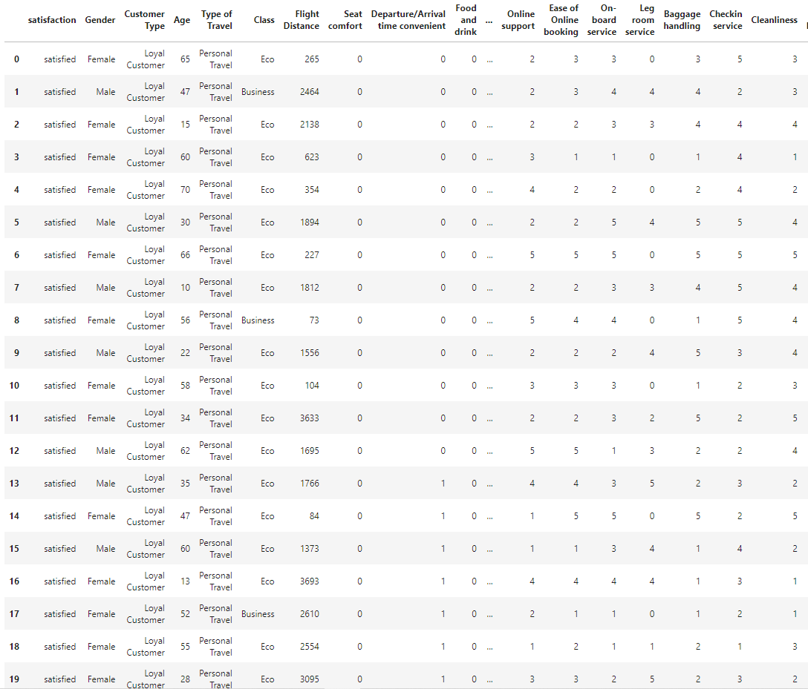

# Airline Satisfaction Project
## Contributors:
- ### Louis Sungwoo Cho
# Project Description

#### An Airbus A350 flies in the blue sky.
- ##### Image source: https://www.airbus.com/en/products-services/commercial-aircraft/passenger-aircraft/a350-family

This project is about analyzing and predicting airline satisfaction patterns among many air travelers. The dataset used for this project was acquired from Kaggle which can be found here:
- https://www.kaggle.com/datasets/teejmahal20/airline-passenger-satisfaction

The brand new Incheon International Airport Terminal 2 (인천국제공항 제2여객터미널) is shown above.
- ##### Image source: https://www.cntraveler.com/story/just-in-time-for-olympics-seouls-incheon-airport-unveils-new-terminal

# Motivation 
Air travel is a crucial type of mobility amongst people who are traveling from one place to another. Air transportation also enables economic growth and development for countries. I was very lucky to use Incheon International Airport to travel around the world because ICN is one of the best airports in the world. Due to severe congestions on roadways, I have also been recently very interested about air transportation and how we could make ways to improve the quality and service of air mobility. As an aviation enthusiast myself, I was also curious about the satisfaction of our airline and airport service. To achieve my goal, I decided to get some air travel datasets and perform experimental data analysis and prediction to analyze and predict the passengers' satisfaction trends of air travel service. 

# Data Visualization

#### Figure 1. above shows the first few dataset of airline satisfaction categorized into passenger types. 

#### Figure 2. above shows the air travel satisfactory level between male and female passengers. 

#### Figure 3. above shows the air travel satisfactory level between loyal and disloyal passengers. 

#### Figure 4. above shows the air travel satisfactory level among passenger travel types. 

#### Figure 5. above shows the air travel satisfactory level among airline seat classes. 
