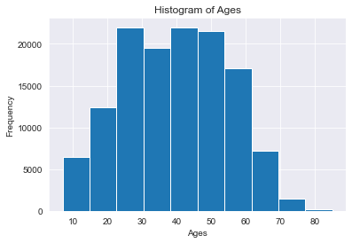
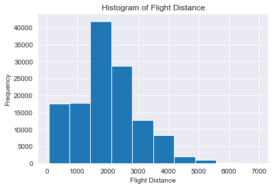
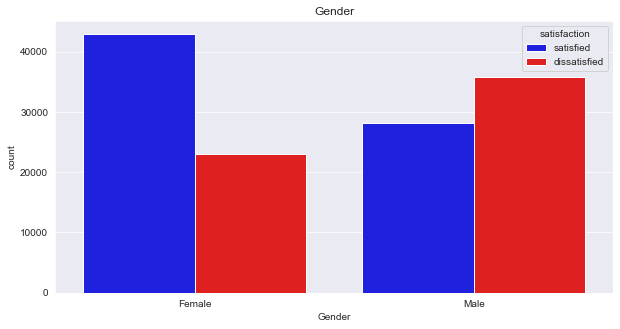
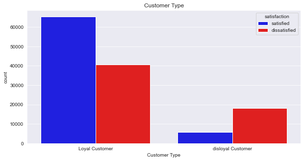
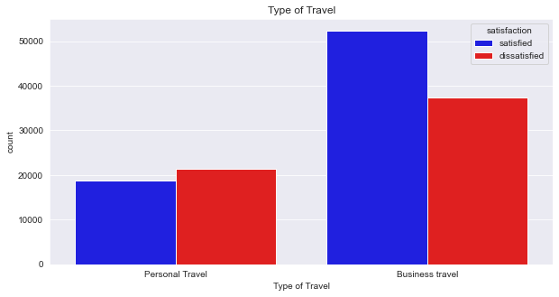
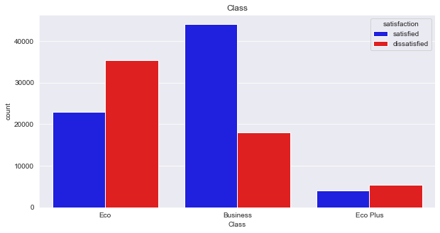
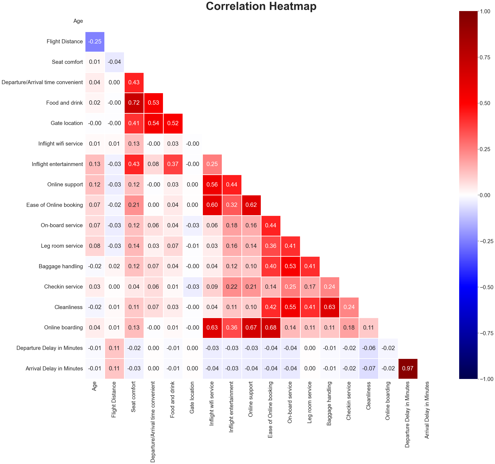
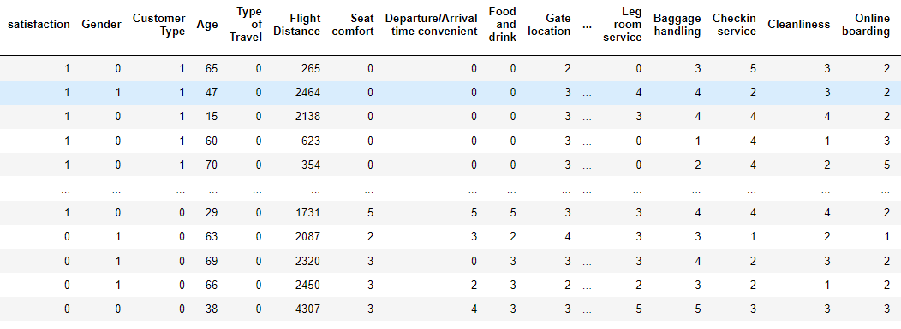
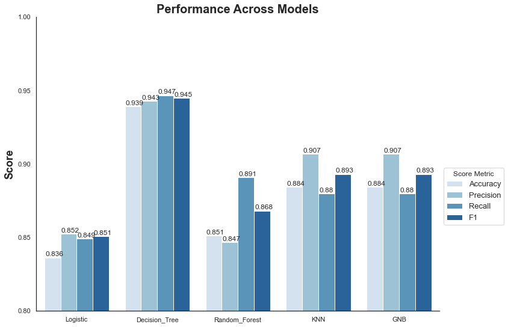

# Airline Satisfaction Analysis & Visualization
## Contributors:
- ### Louis Sungwoo Cho
# Project Description

This project is about analyzing and predicting airline satisfaction patterns among many air travelers. The dataset used for this project was acquired from Kaggle which can be found here:
- https://www.kaggle.com/datasets/teejmahal20/airline-passenger-satisfaction

### An Airbus A350 flies in the blue sky.

- ##### Image source: https://www.airbus.com/en/products-services/commercial-aircraft/passenger-aircraft/a350-family

# Motivation 
Air travel is a crucial type of mobility amongst people who are traveling from one place to another. Air transportation also enables economic growth and development for countries. I was very lucky to use Incheon International Airport to travel around the world because ICN is one of the best airports in the world. Due to severe congestions on roadways, I have also been recently very interested about air transportation and how we could make ways to improve the quality and service of air mobility. As an aviation enthusiast myself, I was also curious about the satisfaction of our airline and airport service. To achieve my goal, I decided to get some air travel datasets and perform experimental data analysis and prediction to analyze and predict the passengers' satisfaction trends of air travel service. 

### Incheon International Airport Terminal 2 (인천국제공항 제2여객터미널) is shown below

- ##### Image source: https://www.cntraveler.com/story/just-in-time-for-olympics-seouls-incheon-airport-unveils-new-terminal

# Data Visualization
Exploratory data anlysis were performed on the airline satisfaction among passengers. The dataset contains various information about the air travelers and indeed visualization is helpful to understand the satisfaction level. First the frequency type of air travelers were visualized and then groups were further broken down to analyze the pattern of airline satisfaction among the members of the particular group. The histograms below show the air travel satisfaction level among the grouped passengers.

#### Figure 1. above shows the ages of airline passengers.

#### Figure 2. above shows how far the passengers travel according to the flight distance.

#### Figure 3. above shows the air travel satisfactory level between male and female passengers. 

#### Figure 4. above shows the air travel satisfactory level between loyal and disloyal passengers. 

#### Figure 5. above shows the air travel satisfactory level among passenger travel types. 

#### Figure 6. above shows the air travel satisfactory level among airline seat classes. 

In addition to the histogram bar plots shown above in the figures, a correlation heatmap was also plotted. The correlation matrix was first computed to determine the correlation between each attribute in the dataframe. Once the correlation matrix values were calculated, using the seaborn library, the correlation heatmap was plotted. The heatmap is shown as a lower triangular 2d matrix.

#### Figure 7. above shows the correlation matrix represented as a heatmap. 

# Dataset Preparation
Before training the entire dataset for machine learning training, the dataset had to be cleaned and changed into numeric form. The data types were classified into binary and non-binary types. Once all the dataset were preprocessed, binary datasets such as gender were given either a value of 0 or 1 according to their respective gender types (i.e Male or Female). Non-binary datasets had to be separated into separate columns and then given a default value of either 0 or 1.

#### Figure 8. above shows the cleaned dataset applied for the machine learning models. 

# Machine Learning 
Analyzing datasets and pattern recognition are crucial for predicting the accuracy of each training model. Here for the machine learning dataset training part, two types of learning were used. First, Supervised Learning was used and then Unsupervised Learning was used to train the given airline passenger dataset. 

## Supervised Learning
Supervised Learning is a machine learning approach which trains the given "labeled" datasets. The two main types of supervised learning this project uses are the following:

### Classification

Being able to accurately assign the datasets into specific categories. The following algorithms were used to perform classification analysis on dataset training:

- ##### Decision Tree Classifier
- ##### Random Forest Classifier
- ##### K-Nearest Neighbors Classifier
- ##### Gaussian Naive Bayes Classifier

### Regression

Being able to understand "dependent" and "independent" variables. Regression is a very useful tool to predict numerical values for mathematical modeling between different data points along the graph. The following algorithms were used to perform regression analysis on dataset training:
- ##### Linear Regression
- ##### Logistic Regression

Once all the supervised learning algorithms performed their dataset training, a dataframe was created to store the accuracy score, precision score, recall score, f1-score with respect to their training model. Then for each supervised learning algorithm, all 4 scores were plotted in a bar graph to determine which model has the most accurate dataset training performance.

##### Figure 9. above shows the histogram graph for each machine learning training algorithm performance. It is determined that the Decision Tree is the most optimal model for this dataset.

## Unsupervised Learning
Unspuervised Learning is a machine learning approach that analyzes and clusters unlabeled datasets. The hidden patterns are discovered without any human iteraction. The following algorithms were used to perform clustering analysis on dataset training:

- ##### KMeans Clustering

# Conclusive Remarks
