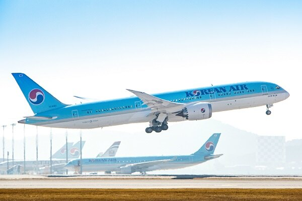
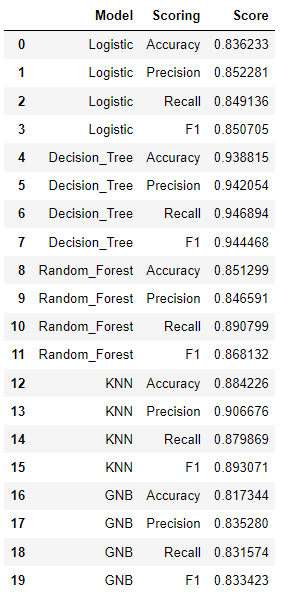
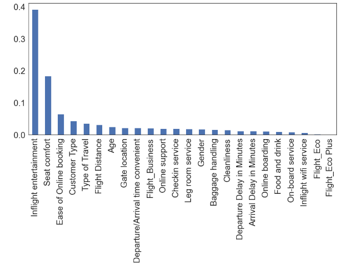
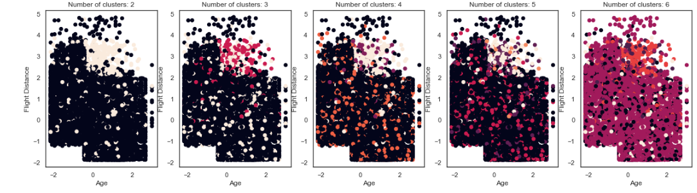
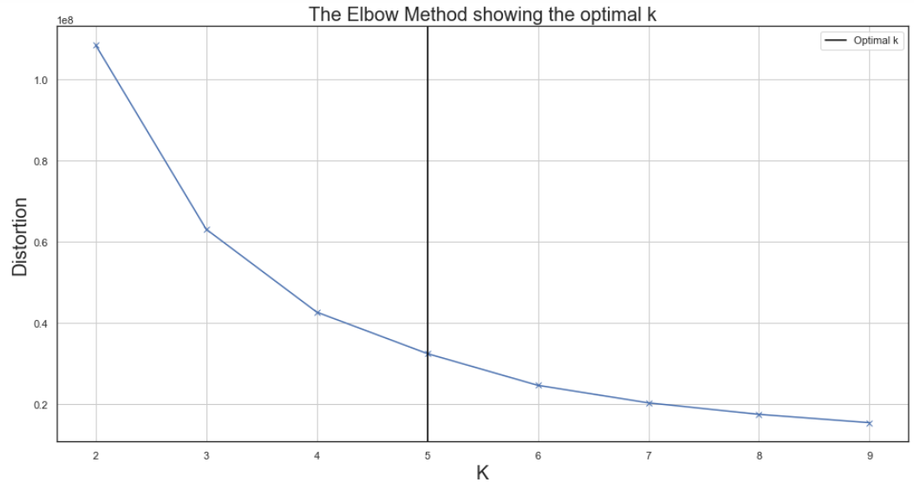
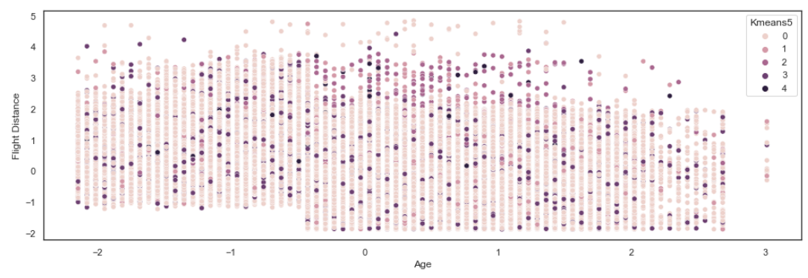
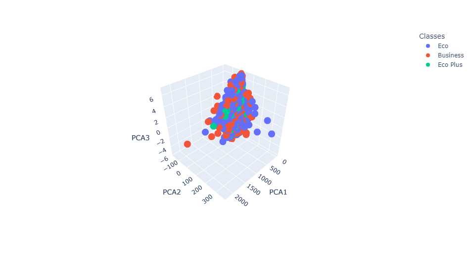
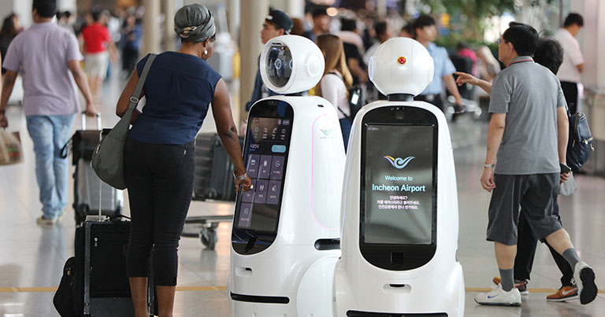

# Airline Satisfaction Analysis & Visualization
## Contributors: 
- ### Louis Sungwoo Cho
# Project Description

This project is about analyzing and predicting airline satisfaction patterns among many air travelers. The dataset used for this project was acquired from Kaggle which can be found here:
- https://www.kaggle.com/datasets/teejmahal20/airline-passenger-satisfaction

### An Airbus A350 aircraft flies in the blue sky.

- ##### Image source: https://www.airbus.com/en/products-services/commercial-aircraft/passenger-aircraft/a350-family

# Motivation 
Air travel is a crucial type of mobility amongst people who are traveling from one place to another. Air transportation also enables economic growth and development for countries. I was very lucky to use Incheon International Airport to travel around the world because ICN is one of the best airports in the world. Due to severe congestions on roadways, I have also been recently very interested about air transportation and how we could make ways to improve the quality and service of air mobility. As an aviation enthusiast myself, I was also curious about the satisfaction of our airline and airport service. To achieve my goal, I decided to get some air travel datasets and perform experimental data analysis and prediction to analyze and predict the passengers' satisfaction trends of air travel service. 

#### Korean Air (대한항공) Boeing 787-9 aircraft takes off at Incheon International Airport (인천국제공항).

- ##### Image source: https://www.koreanair.com/us/en/footer/about-us/newsroom/list/220609--korean-air-to-restore-long-haul-network-destinations-in-

#### Incheon International Airport Terminal 2 (인천국제공항 제2여객터미널) is shown below.

- ##### Image source: https://www.cntraveler.com/story/just-in-time-for-olympics-seouls-incheon-airport-unveils-new-terminal

# Data Visualization
Exploratory data anlysis were performed on the airline satisfaction among passengers. The dataset contains various information about the air travelers and indeed visualization is helpful to understand the satisfaction level. First the frequency type of air travelers were visualized and then groups were further broken down to analyze the pattern of airline satisfaction among the members of the particular group. The histograms below show the air travel satisfaction level among the grouped passengers.

#### Figure 1. above shows the ages of airline passengers.

#### Figure 2. above shows how far the passengers travel according to the flight distance.

#### Figure 3. above shows the air travel satisfactory level between male and female passengers. 

#### Figure 4. above shows the air travel satisfactory level between loyal and disloyal passengers. 

#### Figure 5. above shows the air travel satisfactory level among passenger travel types. 

#### Figure 6. above shows the air travel satisfactory level among airline seat classes. 

In addition to the histogram bar plots shown above in the figures, a correlation heatmap was also plotted. The correlation matrix was first computed to determine the correlation between each attribute in the dataframe. Once the correlation matrix values were calculated, using the seaborn library, the correlation heatmap was plotted. The heatmap is shown as a lower triangular 2d matrix.

#### Figure 7. above shows the correlation matrix represented as a heatmap. 

# Dataset Preparation
Before training the entire dataset for machine learning training, the dataset had to be cleaned and changed into numeric form. The data types were classified into binary and non-binary types. Once all the dataset were preprocessed, binary datasets such as gender were given either a value of 0 or 1 according to their respective gender types (i.e Male or Female). Non-binary datasets had to be separated into separate columns and then given a default value of either 0 or 1.

#### Figure 8. above shows the cleaned dataset applied for the machine learning models. 

# Machine Learning 
Analyzing datasets and pattern recognition are crucial for predicting the accuracy of each training model. Here for the machine learning dataset training part, two types of learning were used. First, Supervised Learning was used and then Unsupervised Learning was used to train the given airline passenger dataset. 

## Supervised Learning
Supervised Learning is a machine learning approach which trains the given "labeled" datasets. The two main types of supervised learning this project uses are the following:

### Classification

Being able to accurately assign the datasets into specific categories. The following algorithms were used to perform classification analysis on dataset training:

- ##### Decision Tree Classifier
- ##### Random Forest Classifier
- ##### K-Nearest Neighbors Classifier
- ##### Gaussian Naive Bayes Classifier

### Regression

Being able to understand "dependent" and "independent" variables. Regression is a very useful tool to predict numerical values for mathematical modeling between different data points along the graph. The following algorithms were used to perform regression analysis on dataset training:
- ##### Linear Regression
- ##### Logistic Regression

Once all the supervised learning algorithms performed their dataset training, a dataframe was created to store the accuracy score, precision score, recall score, f1 score with respect to their training model. Then for each supervised learning algorithm, all 4 scores were plotted in a bar graph to determine which model has the most accurate dataset training performance.

##### Figure 9. above shows the dataframe for the machine learning algorithms with respect to their accuracy score, precision score, recall score, and f1 score.

##### Figure 10. above shows the histogram graph for each machine learning training algorithm performance. 

According to our graph plot of each model above, it is determined that the Decision Tree is the most optimal model for this dataset. To analyze the decision tree algorithm in more depth, the feature importance was plotted with respect to each of their categories. Feature Importance is computed using the decrease impurity for each category across all the trees. Higher the value, higher the importance of that specific feature in the dataset.

#### Figure 11. above shows the histogram graph for each feature importance for the decision tree model.

## Unsupervised Learning
Unspuervised Learning is a machine learning approach that analyzes and clusters unlabeled datasets. The hidden patterns are discovered without any human iteraction. The following algorithms were used to perform clustering analysis on dataset training:

- ##### K-Means Clustering
- ##### Principal Component Analysis (PCA)

First the optimal k value was computed by using the 'Elbow Method.' All the datasets were trained for each value of k ranging from 2 to 10 and then for each time the model is trained, the inertial value of the model is appended to the distortion list. 

#### Figure 12. above shows the k-means model training the dataset.

#### Figure 13. above shows the diagram of the Elbow Method.

Once all the k values for that specific range has been trained, the function to determine the most optimal k was called given the distortion list containing the model inertia value. The tolerance value of 0.2 was given and if the relative error was greater than the tolerance value, the k is incremented. Acoording to the function, 5 is the most optimal value for this unsupervised learning model. 

#### Figure 14. above shows the clustering values between passengers' age and flight distance.

After the K-Means Clustering was performed, the Principal Component Analysis (PCA) was used to visualize the airline seat classes (i.e Business, Economy, Economy Plus). PCA is also an unsupervised machine learning technique thus patterns had to be analyzed to categorize the airline seat classes using the given dataset. To perform PCA, the dataset had to be split into 3 categories. They are Business, Economy Plus, and Economy seats. Once the pattern is recognized into class categories, they are plotted in a 3d graph shown below.

#### Figure 15. above shows the 3d plot of clustered values of passengers with respect to their airline seat class.

# Conclusive Remarks
As we can see from the exploratory data analysis above, we can conclude that there is a significant difference between airline satisfaction level between categorized groups of air travelers. Notably, we can see that female passengers are more satisfied with the air travel than male passengers, loyal customers are more satisfied with the air travel than disloyal travelers, business travelers are more satisfied with air travel than personal travelers, and business class passengers having the highest satisfaction level of air travel. Out of all the supervised machine learning algorithms that has been covered in this project, the Decision Tree model has the highest performance along with Gaussian Naive Bayes model having the lowest performance in our given dataset. For the unsupervised learning algorithms, it has been determined using the Elbow Method that the most optimal value for k in our unsupervised learning model is approximately 5 meaning that the dataset can be classified to 5 different categories. Our PCA model shows that most of the clustered values are economy class passengers meaning that most of the passengers use economy class when traveling. Through machine learning and dataset training, we are able to analyze and understand the patterns between airline satisfaction among passengers. Air travel can be definitely tough due to tough security measures inside the terminal and various immigration laws between countries. It is important that our air transportation system not only be comfortable but also efficient to allow travelers to conveniently travel between places for smart mobility. 

#### Incheon International Airport robots guiding passengers around the airport terminal.
- ##### Image source: https://www.futuretravelexperience.com/2020/05/incheon-airport-presses-ahead-ai-biometrics-big-data/
