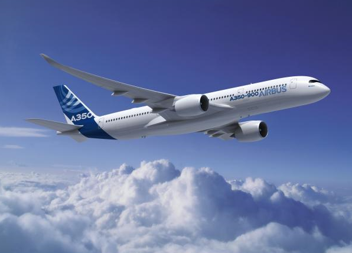

# Airline Satisfaction Project
## Contributors:
- ### Louis Sungwoo Cho
# Project Description

#### An Airbus A350 flies in the blue sky.

This project is about analyzing and predicting airline satisfaction patterns among many air travelers. The dataset used for this project was acquired from Kaggle which can be found here:
- https://www.kaggle.com/datasets/teejmahal20/airline-passenger-satisfaction

# Motivation 
